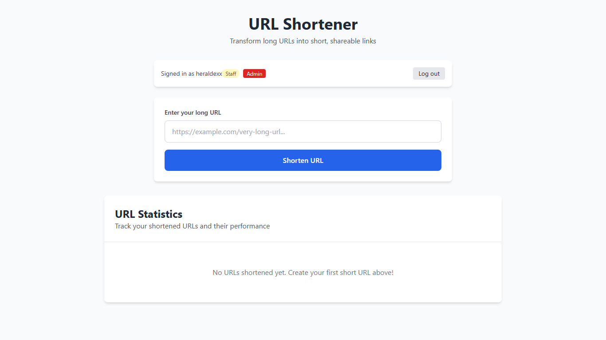

# LinkCrush

[](LICENSE)
[](https://www.python.org/downloads/)
[](https://www.postgresql.org/download/)
[](https://nextjs.org/)
[](https://github.com/HERALDEXX/link-crush/issues)
[](https://github.com/HERALDEXX/link-crush/pulls)

Transform endless URLs into powerful, trackable links with professional URL shortening, real-time analytics, and lightning-fast redirects.

## Table of Contents

- 🚀 [Features](#features)
- 📸 [Screenshots](#screenshots)
- 🛠️ [Tech Stack](#tech-stack)
- 📋 [Prerequisites](#prerequisites)
- 🚀 [Quick Start](#quick-start)
- 🎨 [Frontend Options](#frontend-options)
- 🔐 [Authentication & User Management](#authentication--user-management)
- 📁 [Project Structure](#project-structure)
- 📚 [API Documentation](#api-documentation)
- 🔄 [Development](#development)
- 🌿 [Branches](#branches)
- 🚀 [Deployment](#deployment)
- 🔧 [Troubleshooting](#troubleshooting)
- 🤝 [Contributing](#contributing)

## Features

- **Modern URL Shortening**: Convert long URLs into short, shareable links with a stunning interface
- **Dual Frontend Options**: Choose between modern Next.js or lightweight vanilla JavaScript
- **Real-time Analytics**: Monitor click counts and performance metrics
- **Professional Dashboard**: Beautiful glassmorphism design with smooth animations
- **User Authentication**: JWT-based authentication for URL management
- **Admin Interface**: Django admin panel for user management and backend administration
- **Mobile-First Design**: Responsive interface that works perfectly on all devices
- **One-Click Sharing**: Copy to clipboard functionality with visual feedback
- **Dark Theme**: Modern gradient backgrounds with dynamic visual effects
- **RESTful API**: Clean API endpoints for integration

## Screenshots

### Modern Next.js Frontend

**🌟 Landing Page (Not Signed In)**


**🔐 Signed-In Dashboard**


**📊 URL Analytics**


### Legacy Vanilla Frontend

**⚡ Signed-In Interface**


---

## Tech Stack

### Backend
- **Django 4.2.7** - Python web framework
- **Django REST Framework** - API development
- **PostgreSQL 12+** with psycopg2 - Database
- **JWT Authentication** - Secure user sessions

### Frontend Options

**🔥 Modern Frontend (Next.js 15)**
- **Next.js 15.5.3** - React framework with App Router
- **React 19** - Latest React with modern hooks
- **TypeScript** - Type-safe development
- **Tailwind CSS v4** - Modern utility-first styling
- **Glassmorphism UI** - Contemporary design with backdrop blur effects
- **Advanced Animations** - Smooth transitions and micro-interactions

**⚡ Legacy Frontend (Vanilla)**
- **HTML5, CSS3, JavaScript ES6+** - Lightweight and fast
- **Tailwind CSS** - Utility-first styling
- **Vanilla JavaScript** - No framework dependencies
- **Simple animations** - CSS-based transitions

### Hosting
- **Railway/Render** (backend)
- **Vercel/Netlify** (frontend)

## Prerequisites

- **Python 3.8+** - [Download](https://www.python.org/downloads/)
- **Node.js 18+** - [Download](https://nodejs.org/) (for Next.js frontend)
- **PostgreSQL 12+** - [Download](https://www.postgresql.org/download/)
- **Git** - [Download](https://git-scm.com/downloads)

Verify installation:
```bash
python --version && node --version && psql --version && git --version
```

## Quick Start

### **Step 1: Clone and setup**

```bash
git clone https://github.com/HERALDEXX/link-crush.git
cd link-crush
cd backend && python -m venv venv
```

### **Step 2: Activate virtual environment**

```bash
# Windows
.\venv\Scripts\activate.bat

# Unix-based (macOS, Linux, etc)
source venv/bin/activate
```

### **Step 3: Install backend dependencies**

```bash
pip install -r requirements.txt
cd ..  # Go back to root directory for shared .env
```

### **Step 4: Environment setup**

```bash
# Windows
copy .env.example .env

# Unix-based (macOS, Linux, etc)
cp .env.example .env
```

Generate Django secret key:
```bash
cd backend
python -c "from django.core.management.utils import get_random_secret_key; print(get_random_secret_key())"
```

Edit `.env` file and replace `SECRET_KEY` value with the generated key.

### **Step 5: Database setup**

Connect to PostgreSQL and create database:
```bash
psql -U postgres
```

```sql
-- Create database
CREATE DATABASE link_crush;

-- Create user with password
-- Replace 'your_postgresql_password' with your desired password for the user link_crush_user
CREATE USER link_crush_user WITH ENCRYPTED PASSWORD 'your_postgresql_password';

-- Grant privileges
GRANT ALL PRIVILEGES ON DATABASE link_crush TO link_crush_user;

-- Connect to the database
\c link_crush;

-- Grant schema privileges
GRANT ALL ON SCHEMA public TO link_crush_user;

-- Exit
\q
```

Edit `.env` file (in root directory) and replace the values for:

- `DATABASE_PASSWORD` with the password you set for `link_crush_user` in [Step 5](#step-5-database-setup)
- `DATABASE_HOST` **if only** you are using a custom host, otherwise leave as `localhost`
- `DATABASE_PORT` **if only** you set a custom port, otherwise leave as `5432`

### **Step 6: Run Django setup**

```bash
cd backend
python manage.py makemigrations
python manage.py migrate
python manage.py createsuperuser
python manage.py collectstatic  # If DEBUG=False
```

### **Step 7: Start backend server**

```bash
python manage.py runserver
```

## Frontend Options

Choose between our **modern Next.js frontend** or **lightweight legacy frontend**:

### 🔥 **Option A: Modern Next.js Frontend (Recommended)**

**Features:**
- ✨ Stunning glassmorphism design
- 🎨 Advanced animations and transitions  
- 🚀 Lightning-fast performance
- 📱 Mobile-first responsive design
- 🔒 TypeScript for better development experience

**Setup:**
```bash
# New terminal window
cd frontend
npm install
npm run dev
```

**Access:** http://localhost:3000

### ⚡ **Option B: Legacy Vanilla Frontend**

**Features:**
- 🪶 Lightweight and fast
- 📦 No build process required
- 🔧 Simple to customize
- 🌐 Works in any browser

**Setup:**
```bash
# New terminal window
cd legacy-frontend
python -m http.server 8080
```

**Access:** http://localhost:8080

## Authentication & User Management

**Authentication is required for URL management operations** including deleting URLs and accessing user-specific features.

### Creating User Accounts

User accounts must be created through the Django admin dashboard:

1. **Start the backend server:**
   ```bash
   cd backend && python manage.py runserver
   ```

2. Access admin dashboard: [`http://localhost:8000/admin/`](http://localhost:8000/admin/)
3. Login with superuser credentials
4. Create new users with appropriate permissions

### Frontend Authentication

Users can log in through either frontend interface:
- **Modern Frontend**: Glassmorphism login form with smooth animations
- **Legacy Frontend**: Simple, clean login interface
- Both use JWT tokens for secure API access
- Staff/admin badges display user permissions

## Project Structure

```
link-crush/
├── frontend/                    # 🔥 Modern Next.js Frontend
│   ├── src/
│   │   ├── app/
│   │   │   ├── globals.css     # Enhanced Tailwind v4 + animations
│   │   │   ├── layout.tsx      # Root layout
│   │   │   └── page.tsx        # Main page component
│   │   ├── components/         # React components
│   │   │   ├── AuthBlock.tsx   # Glassmorphism auth interface
│   │   │   ├── URLShortenerForm.tsx  # Modern form with animations
│   │   │   ├── StatisticsTable.tsx   # Beautiful analytics display
│   │   │   └── Toast.tsx       # Modern notifications
│   │   ├── hooks/              # Custom React hooks
│   │   └── lib/                # Utilities and API client
│   ├── package.json
│   └── tailwind.config.js      # Tailwind v4 configuration
│
├── legacy-frontend/            # ⚡ Legacy Vanilla Frontend  
│   ├── index.html             # Main HTML file
│   ├── css/styles.css         # Custom CSS animations
│   ├── js/app.js             # Vanilla JavaScript logic
│   └── config.js             # Frontend configuration
│
├── backend/                   # Django Backend
│   ├── urlshortener/         # Django project
│   ├── urls/                 # Django app
│   ├── manage.py
│   ├── requirements.txt
│   └── venv/                 # Virtual environment
│
├── database/postgresql_schema.sql  # Database reference
├── .env                      # Environment variables (not in VCS)
├── .env.example             # Environment template
└── README.md
```

## API Documentation

See [docs/API_CONTRACT.md](docs/API_CONTRACT.md) for full API specification.

### Quick Reference

**Core Endpoints:**
- `POST /api/shorten` - Create shortened URL
- `GET /api/stats` - Get URL statistics  
- `GET /{shortCode}` - Redirect to original URL
- `DELETE /api/urls/{shortCode}/` - Delete URL (auth required)

**Authentication:**
- `POST /api/token/` - Login and get JWT tokens
- `GET /api/me` - Get current user info

**System:**
- `GET /api/health` - Health check

### Example Usage

```bash
# Shorten URL
curl -X POST http://localhost:8000/api/shorten \
  -H "Content-Type: application/json" \
  -d '{"url": "https://example.com/long-url"}'

# Get statistics
curl http://localhost:8000/api/stats

# Login
curl -X POST http://localhost:8000/api/token/ \
  -H "Content-Type: application/json" \
  -d '{"username": "your_user", "password": "your_pass"}'
```

## Development

### Daily Workflow

**Backend:**
```bash
cd backend && .\venv\Scripts\activate.bat  # or source venv/bin/activate on Unix (macOS, Linux, etc)
python manage.py runserver
```

**Modern Frontend:**
```bash
cd frontend && npm run dev
```

**Legacy Frontend:**
```bash
cd legacy-frontend && python -m http.server 8080
```

### Environment Variables

Create `.env.local` in frontend directory for Next.js:
```env
NEXT_PUBLIC_API_URL=http://localhost:8000/api
NEXT_PUBLIC_SHORT_URL_BASE=http://localhost:8000
```

### Making Changes

- **Next.js Frontend**: Edit files in `src/`, hot reload is automatic
- **Legacy Frontend**: Edit HTML/CSS/JS directly, refresh browser
- **Backend**: Django auto-reloads on file changes

### Database Changes

```bash
cd backend
python manage.py makemigrations
python manage.py migrate
```

## Branches

- [**main**](https://github.com/HERALDEXX/link-crush/tree/main) → Production-ready code (default branch)
- [**dev**](https://github.com/HERALDEXX/link-crush/tree/dev) → Active development

Create feature branches from `dev`: `git checkout -b dev/feature/your-feature`

## Deployment

### Backend (Railway/Render)

Environment variables:
```env
SECRET_KEY=your-production-secret-key-50-chars
DEBUG=False
DATABASE_NAME=production_db_name
DATABASE_USER=production_user
DATABASE_PASSWORD=production_password
DATABASE_HOST=production_host
DATABASE_PORT=5432
CORS_ALLOWED_ORIGINS=https://your-domain.com
```

### Modern Frontend (Vercel - Recommended)

1. Connect GitHub repository
2. Framework preset: **Next.js**
3. Root directory: `frontend`
4. Environment variables:
   ```env
   NEXT_PUBLIC_API_URL=https://your-backend.railway.app/api
   NEXT_PUBLIC_SHORT_URL_BASE=https://your-backend.railway.app
   ```

### Legacy Frontend (Netlify)

1. Connect GitHub repository  
2. Build directory: `legacy-frontend`
3. No build command needed
4. Update `config.js` with production API URL

## Troubleshooting

### Backend Issues

**Server won't start:**
- Check PostgreSQL is running: `sudo systemctl status postgresql`
- Verify `.env` database credentials
- Ensure virtual environment is activated

**Database connection failed:**
- Test connection: `psql -U link_crush_user -d link_crush -h localhost`
- Check database exists: `psql -U postgres -l | grep link_crush`

### Frontend Issues

**Next.js build fails:**
- Clear cache: `rm -rf .next node_modules package-lock.json`
- Reinstall: `npm install`
- Check Node.js version: `node --version` (requires 18+)

**Tailwind styles not working:**
- Ensure you're using Tailwind v4 syntax in `globals.css`
- Restart dev server after config changes

**API calls failing:**
- Check `NEXT_PUBLIC_API_URL` in `.env.local`
- Verify backend is running on correct port
- Check browser Network tab for CORS errors

### Common Issues

**CORS errors:**
- Add frontend URL to `CORS_ALLOWED_ORIGINS` in Django settings
- Ensure trailing slashes match between frontend and backend URLs

**JWT token expired:**
- Tokens auto-refresh in modern frontend
- Legacy frontend requires manual re-login

## Contributing

1. Fork the repository
2. Create feature branch from `dev`
3. Make your changes
4. Test both frontend options
5. Submit pull request to `dev` branch

Please read [CONTRIBUTING.md](CONTRIBUTING.md) for detailed guidelines.

## License

MIT License - see [LICENSE](LICENSE) file for details.

---

**⭐ Star this repo** if you found it helpful!

**🐛 Found a bug?** Create an [issue](https://github.com/HERALDEXX/link-crush/issues)

**💡 Have a feature idea?** We'd love to hear it in [discussions](https://github.com/HERALDEXX/link-crush/discussions)